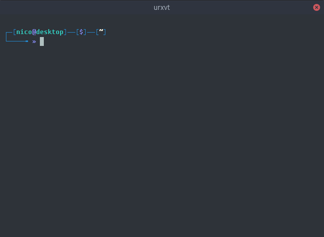

# Change to Directory Bookmark

A simple shell tool for bookmarking directories in the filesystem. At the moment it only supports bash. If you want contribute by extending the support to other shells you are very welcome :).



 # Build Dependencies
 - cargo >= 1.42.1
 - rustc >= 1.41.1

# Building and installing

## From source
```bash
# Build
make
# Install
sudo make install
```

## Binary packages
You can download a binary package (deb/rpm) from [here](https://github.com/nicoan/cdb/releases).

# Documentation
You can check the man pages with

```bash
man cdb
```

# Usage

```
cdb [OPTION] [--] [bookmark]
```

## Change directory to a bookmark

```
cdb <bookmark>
```

where `<bookmark>` is a bookmark name.

## Options

- `-h, --help`: Prints help information
- `-l, --list`: List all bookmarks
- `-V, --version`: Prints version information
- `-a, --add <bookmark> <path>`: Adds a directory bookmark with name <bookmark> pointing at <path>
- `-f, --find <pattern>`: List all the bookmark names that start with <pattern>
- `-r, --remove <bookmark>`: Removes a directory bookmark with name <bookmark>
- `-s, --show <bookmark>`: Outputs where <bookmark> is pointing
- `-u, --update <bookmark> <new_path>`: Updates the path pointed by <bookmark>

## Example

```bash
# Adds a directory bookmark named "projects" pointing to /home/foo/projects path.
cdb --add projects /home/foo/projects

# Updates the path pointed by the bookmark named "projects" from /home/foo/projects
# to /home/bar/projects.
cdb -u projects /home/bar/projects

# Changes the current directory to the one pointed by "projects" bookmark.
cdb projects
```
